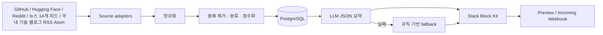

# glean-ai

AI 뉴스와 국내 기술 블로그의 기술 글을 수집·정규화·분석하고 매일 한국어 Slack 브리프를 전송하는 최소 운영 파이프라인입니다.

## 가정과 현재 범위

- 실행: Docker Compose, 배포: GitHub Actions cron, DB: PostgreSQL.
- 보고: 매일 08:00 Asia/Seoul, 한국어, Incoming Webhook. AI 뉴스와 AI 기술로 나눠 모든 수집 항목을 전송합니다.
- 후보 수집 상한: source당 100개. 기본 관심 목록과 RSS/Atom 피드는 `config/interests.yaml`에서 관리합니다.
- GitHub, Hugging Face, Reddit은 기존 조건에 맞는 후보를 모두 저장합니다. Daily AI Thread의 14개 뉴스 피드와 카카오 테크, 네이버 D2, 토스 테크, 우아한형제들 기술블로그를 RSS/Atom으로 수집합니다.
- 초기 중복 처리는 canonical URL과 `SequenceMatcher` 문자열 유사도(0.88)를 사용합니다. 운영이 단순하지만 의미가 같은 다른 표현을 놓칠 수 있습니다.
- GitHub Actions에는 영속 PostgreSQL `DATABASE_URL`이 필요합니다. Actions runner 자체 DB는 실행 간 보존되지 않습니다.

## 구조와 데이터 흐름



모든 시각은 DB에 UTC로 저장하고 보고 시 `Asia/Seoul`로 변환합니다. `source + external_id` unique 제약과 날짜별 보고 이력으로 재실행 중복을 막습니다. 일부 source가 실패해도 나머지는 전송하며 Slack 상단에 실패 상태를 표시합니다.

## 로컬 실행

Python 3.12가 필요합니다.

```bash
cp .env.example .env
docker compose up -d db
python -m venv .venv
. .venv/bin/activate
pip install -e '.[dev]'
alembic upgrade head
glean-ai collect
glean-ai preview
glean-ai report --dry-run
```

전체 명령:

```bash
glean-ai collect                         # 전체 수집
glean-ai collect --source github         # 단일 source
glean-ai analyze --hours 24              # 최근 데이터 분석
glean-ai preview --hours 24              # Slack JSON 미리보기
glean-ai report                           # 전송
glean-ai report --force                   # 같은 날짜 재전송
glean-ai daily --dry-run                  # 수집+보고, 외부 전송/DB 기록 없음
glean-ai backfill 2026-08-01 2026-08-02  # 기간 수집 진입점
glean-ai health
```

GitHub Actions의 기본 브랜치에 반영한 뒤 `Actions > daily-glean-ai > Run workflow`에서 수동 실행할 수 있습니다. 기본 `dry_run`은 미리 보기이며, 새 수집 결과를 DB에 저장하지 않고 Slack도 발송하지 않습니다. 대신 수집한 항목으로 만든 브리프를 Actions 로그에 출력합니다. 실제 저장·발송을 확인할 때는 `dry_run`을 끄고, 오늘 이미 보낸 브리프도 다시 발송하려면 `force`를 켭니다. 워크플로는 두 경우 모두 먼저 DB migration을 적용합니다. 실행에는 영속 PostgreSQL을 가리키는 `DATABASE_URL` secret이 필요합니다.

`config/interests.yaml`에서 키워드, subreddit, `ai_news_feeds`, `tech_blogs` 피드를 수정합니다. GitHub는 관심 키워드와 관련되고 stars가 10개 이상인 저장소, Hugging Face는 관심 키워드 또는 AI 작업 태그에 맞고 `trendingScore > 0`, 좋아요 50개 이상 또는 다운로드 5,000회 이상을 충족하는 모델을 후보로 삼습니다. Reddit은 공식 공개 RSS에서 최근 하루의 인기 게시물을 가져옵니다. 세 source 모두 조건을 통과한 후보를 저장하고 보고서에 포함합니다. 뉴스 매체와 기술 블로그 피드는 해당 AI/기술 피드에 포함된 게시물을 수집하므로 기존 AI 키워드 일치 여부를 별도로 요구하지 않습니다. 피드에 공개된 제목·요약·작성자·날짜·원문 링크를 사용하고, 원문 전체는 별도 크롤링하지 않습니다. 피드마다 공개 글 수와 본문 길이가 다르며 MIT Technology Review 등 일부 매체의 원문은 구독이 필요할 수 있습니다. Hacker News 검색 피드는 hnrss.org 중계 서비스에 의존합니다. GitHub Actions에서는 저장소 기본 토큰과 코드에 정의한 Reddit User-Agent를 사용합니다.

## 점수와 요약

`final = relevance×0.35 + trend×0.30 + quality×0.20 + freshness×0.15`; 전부 0~100입니다. 참여량은 source 내부 최대값으로 정규화하며 각 요소를 `score_reasons` JSON에 보존합니다. 보고 기간 내 모든 항목을 점수순으로 정렬해 AI 뉴스와 AI 기술 메시지에 나눠 담고, 각 메시지 안에서 소스별 구획을 표시합니다.

LLM은 외부 본문을 데이터로 명시하고 구조화 JSON을 검증해 `무슨 소식인지`와 `왜 중요한지`를 한국어로 편집합니다. 2회 실패 또는 키 미설정 시에도 원문 태그를 복사하지 않고 한국어 안내 문구로 계속합니다. 규칙 기반 fallback은 번역·해석이 아니라는 한계가 있습니다.

## Slack과 스케줄

Webhook URL을 설정하고 `glean-ai report`를 실행합니다. Slack 메시지는 `AI 뉴스`와 `AI 기술` 두 개이며, 두 메시지에 `interests.yaml`의 18개 피드 ID와 GitHub·Hugging Face·Reddit을 합친 21개 소스 구획을 표시합니다. 각 구획에는 보고 기간에 수집한 모든 항목을 제목·링크·요약·실무 포인트 형식으로 담습니다. Block Kit 한도에 맞게 요약과 실무 포인트를 압축할 수 있으며 제목과 링크는 유지합니다. 제목·링크만으로도 50개 블록을 넘으면 보고를 실패 처리해 항목을 누락하지 않습니다. `daily`에서는 수집 결과가 없거나 실패한 플랫폼에도 수집 상태를 표시합니다. GitHub는 stars와 forks를, Reddit은 최근 24시간 인기 순위를 지표로 사용합니다. 동일 로컬 날짜는 한 번만 전송하며 `--force`만 재전송을 허용합니다. 전송이 중간에 실패하면 이미 성공한 메시지 그룹을 기록해 재실행 시 건너뜁니다. `.github/workflows/daily.yml`의 `23:00 UTC`는 한국 시간 08:00입니다. Section block 텍스트는 2,900자 이하로 나누고 메시지마다 최대 50개 블록을 사용합니다.

## 테스트와 검증

```bash
pytest
ruff check .
mypy
docker compose config
```

mock 기반 GitHub·Hugging Face·Reddit 정규화, idempotency, URL/텍스트 중복, 점수, 분류, 부분 실패, LLM fallback, Block Kit, Slack 중복 방지, dry-run을 검증합니다.

## 새 adapter 추가

`collectors/base.py`의 `Collector`를 상속하고 `collect()`에서 공통 `Content`를 반환합니다. `DailyService.collectors()`와 enable 설정을 추가하고 응답 정규화·부분 실패 테스트를 작성합니다. 공식 API/SDK만 사용하고 권한이 없으면 adapter만 비활성화합니다.

## 운영·장애 대응

- Slack 상단과 JSON 로그의 source 상태 및 `runs` 이력을 확인합니다. timeout/transport 오류는 지수 backoff로 3회 재시도하며 HTTP 429의 `Retry-After`를 준수합니다.
- 토큰은 `SecretStr`로 관리하고 오류 메시지의 인증 헤더 명칭을 마스킹합니다. 원문은 요약에 필요한 excerpt와 공개 metadata만 저장합니다.
- PostgreSQL은 매일 관리형 snapshot을 권장합니다. 기본 보존 가정은 콘텐츠 90일, 실행 이력 30일이며 실제 삭제 job은 배포 환경에서 설정해야 합니다.
- 삭제: source 약관/요청에 따라 `contents`의 source 또는 external ID로 삭제합니다. DB 백업 보존분도 정책에 맞춰 만료시킵니다.
- 비용: PostgreSQL, 외부 API 유료 tier, LLM tokens, GitHub Actions 사용량, Slack 운영 비용.

## 알려진 제약

- Hugging Face 현재 구현은 model만 수집합니다. dataset/space와 GitHub release·증가량 시계열은 후속 범위입니다.
- RSS/Atom은 게시자가 공개한 피드 항목만 사용합니다. 본문이 피드에 포함되지 않으면 원문 페이지를 별도로 크롤링하지 않습니다.
- 서로 다른 source의 의미 기반 클러스터링은 문자열 유사도만 사용합니다.
- 보존 기간 자동 삭제와 상세 리포트 artifact 저장은 아직 없습니다.
