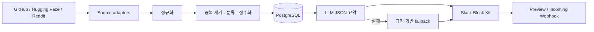

# glean-ai

기획·개발·디자인 분야의 AI 신호를 수집·정규화·분석하고 매일 한국어 Slack 브리프를 전송하는 최소 운영 파이프라인입니다.

## 가정과 현재 범위

- 실행: Docker Compose, 배포: GitHub Actions cron, DB: PostgreSQL.
- 보고: 매일 08:00 Asia/Seoul, 한국어, Incoming Webhook, 최대 10건.
- 수집 상한: source당 100개. 기본 관심 목록은 `config/interests.yaml`.
- GitHub, Hugging Face, Reddit를 구현했습니다. 테스트는 실제 API를 호출하지 않습니다.
- X와 Threads는 공식 API 권한·관심 계정이 제공되지 않아 기본 비활성입니다. 검색 기능을 우회 구현하지 않습니다. Threads 공식 API의 계정 기반 지원 범위는 앱 권한에 따라 달라집니다.
- 초기 중복 처리는 canonical URL과 `SequenceMatcher` 문자열 유사도(0.88)를 사용합니다. 운영이 단순하지만 의미가 같은 다른 표현을 놓칠 수 있습니다.
- GitHub Actions에는 영속 PostgreSQL `DATABASE_URL`이 필요합니다. Actions runner 자체 DB는 실행 간 보존되지 않습니다.

## 구조와 데이터 흐름



모든 시각은 DB에 UTC로 저장하고 보고 시 `Asia/Seoul`로 변환합니다. `source + external_id` unique 제약과 날짜별 보고 이력으로 재실행 중복을 막습니다. source별 실패는 실행 이력에 부분 실패로 남고 나머지는 계속됩니다.

## 로컬 실행

Python 3.12가 필요합니다.

```bash
cp .env.example .env
docker compose up -d db
python -m venv .venv
. .venv/bin/activate
pip install -e '.[dev]'
alembic upgrade head
glean-ai collect
glean-ai preview
glean-ai report --dry-run
```

전체 명령:

```bash
glean-ai collect                         # 전체 수집
glean-ai collect --source github         # 단일 source
glean-ai analyze --hours 24              # 최근 데이터 분석
glean-ai preview --hours 24              # Slack JSON 미리보기
glean-ai report                           # 전송
glean-ai report --force                   # 같은 날짜 재전송
glean-ai daily --dry-run                  # 수집+보고, 외부 전송/DB 기록 없음
glean-ai backfill 2026-08-01 2026-08-02  # 기간 수집 진입점
glean-ai health
```

`config/interests.yaml`에서 키워드, 관심 계정·저장소·subreddit을 수정합니다. `.env.example`은 DB, Slack, LLM, source 인증, enable flag, 시간대, 상한을 문서화합니다. 실제 secret은 `.env` 또는 GitHub Secrets에만 둡니다.

## 점수와 요약

`final = relevance×0.35 + trend×0.30 + quality×0.20 + freshness×0.15`; 전부 0~100입니다. 참여량은 source 내부 최대값으로 정규화하며 각 요소를 `score_reasons` JSON에 보존합니다. 보고서는 점수순 후보에서 Product·Dev·Design 항목을 우선 확보하고 한 source가 전체의 40%를 넘지 않도록 최대 10건을 고릅니다. 따라서 후보가 한 source에만 몰린 날에는 억지로 10건을 채우지 않습니다.

LLM은 외부 본문을 데이터로 명시하고 구조화 JSON을 검증해 `무슨 소식인지`와 `왜 중요한지`를 한국어로 편집합니다. 2회 실패 또는 키 미설정 시에도 원문 태그를 복사하지 않고 source별 한국어 안내 문구로 계속합니다. 규칙 기반 fallback은 번역·해석이 아니라는 한계가 있습니다.

## Slack과 스케줄

Webhook URL을 설정하고 `glean-ai report`를 실행합니다. 동일 로컬 날짜는 한 번만 전송하며 `--force`만 재전송을 허용합니다. `.github/workflows/daily.yml`의 `23:00 UTC`는 한국 시간 08:00입니다. Block Kit 각 section은 2,900자로 제한합니다.

## 테스트와 검증

```bash
pytest
ruff check .
mypy
docker compose config
```

mock 기반 3-source 정규화, idempotency, URL/텍스트 중복, 점수, 분류, LLM fallback, Block Kit, Slack 중복 방지, dry-run을 검증합니다.

## 새 adapter 추가

`collectors/base.py`의 `Collector`를 상속하고 `collect()`에서 공통 `Content`를 반환합니다. `DailyService.collectors()`와 enable 설정을 추가하고 응답 정규화·부분 실패 테스트를 작성합니다. 공식 API/SDK만 사용하고 권한이 없으면 adapter만 비활성화합니다.

## 운영·장애 대응

- JSON 로그의 `source_failed`와 `runs` 상태를 확인합니다. timeout/transport 오류는 지수 backoff로 3회 재시도합니다. HTTP 429의 `Retry-After`를 준수합니다.
- 토큰은 `SecretStr`로 관리하고 오류 메시지의 인증 헤더 명칭을 마스킹합니다. 원문은 요약에 필요한 excerpt와 공개 metadata만 저장합니다.
- PostgreSQL은 매일 관리형 snapshot을 권장합니다. 기본 보존 가정은 콘텐츠 90일, 실행 이력 30일이며 실제 삭제 job은 배포 환경에서 설정해야 합니다.
- 삭제: source 약관/요청에 따라 `contents`의 source 또는 external ID로 삭제합니다. DB 백업 보존분도 정책에 맞춰 만료시킵니다.
- 비용: PostgreSQL, 외부 API 유료 tier, LLM tokens, GitHub Actions 사용량, Slack 운영 비용.

## 알려진 제약

- Hugging Face 현재 구현은 model만 수집합니다. dataset/space와 GitHub release·증가량 시계열은 후속 범위입니다.
- Reddit는 공개 JSON endpoint 최소 구현입니다. 대규모 운영은 OAuth 자격증명 기반 공식 API client로 교체해야 합니다.
- 서로 다른 source의 의미 기반 클러스터링은 문자열 유사도만 사용합니다.
- 보존 기간 자동 삭제와 상세 리포트 artifact 저장은 아직 없습니다.
