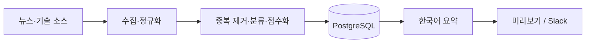

# 🌾 glean-ai

AI 뉴스와 기술 글을 수집·분석해 매일 한국어 Slack 브리프로 전하는 파이프라인입니다. GitHub, Hugging Face, Reddit, AI 뉴스 피드, 국내외 기술 블로그를 한곳에서 살펴볼 수 있습니다.

## 핵심 기능과 흐름

- 관심 키워드와 피드를 바탕으로 수집하고, 중복 제거·분류·점수화를 거쳐 PostgreSQL에 저장합니다.
- LLM으로 한국어 제목과 요약을 만들고, `AI 뉴스` 최대 28개와 `AI 기술` 최대 24개를 소스별로 묶어 Slack Incoming Webhook으로 보냅니다.
- 일부 소스가 실패해도 나머지 결과로 브리프를 만들며, `daily` 결과에는 수집 상태를 표시합니다.
- 설정된 시간대의 같은 날짜에는 한 번만 전송합니다. 중간 전송 실패 후 재실행하면 이미 보낸 메시지 그룹은 건너뜁니다.


```mermaid
flowchart LR
  A[뉴스·기술 소스] --> B[수집·정규화]
  B --> C[중복 제거·분류·점수화]
  C --> D[(PostgreSQL)]
  D --> E[한국어 요약]
  E --> F[미리보기 / Slack]
```

## 🚀 로컬 빠른 실행

Docker Compose가 필요합니다. 앱 컨테이너는 Python 3.12를 사용하며, PostgreSQL은 Compose 내부에서 연결합니다.

```bash
cp .env.example .env
# .env에 필요한 API 키와 Slack Webhook을 설정합니다.
docker compose up -d db
docker compose build app
docker compose run --rm --volume "$PWD/.env:/app/.env:ro" --entrypoint alembic app upgrade head
docker compose run --rm --volume "$PWD/.env:/app/.env:ro" app daily --dry-run
```

마지막 명령은 수집 결과와 Slack JSON을 출력하며 새 수집 결과·실행 이력·전송 이력을 저장하거나 Slack에 발송하지 않습니다. 기존 DB를 조회하므로 migration이 필요하고, 외부 소스 수집과 설정된 LLM 호출은 수행합니다. 실제 저장·발송은 같은 명령에서 `--dry-run`을 제거합니다.

Compose는 앱의 `DATABASE_URL`을 내부 DB 주소로 지정하고, DB 비밀번호는 `POSTGRES_PASSWORD`(미설정 시 Compose 기본값)를 사용합니다. 호스트에서 Python으로 직접 실행하려면 Python 3.12 이상과 접근 가능한 PostgreSQL을 준비하고 `.env`의 `DATABASE_URL`을 맞춰야 합니다. 기본 Compose DB는 호스트 포트를 공개하지 않습니다.

## 주요 명령

컨테이너에서는 위 예시의 `app` 뒤에 명령을 넣습니다. 호스트에 `pip install -e '.[dev]'`로 설치했다면 다음처럼 실행합니다.

```bash
glean-ai collect                    # 전체 수집 및 저장
glean-ai collect --source github    # 단일 소스 수집
glean-ai analyze --hours 24         # 최근 데이터 확인
glean-ai preview --hours 24         # 저장된 데이터로 Slack JSON 미리보기
glean-ai report --dry-run           # 저장된 데이터로 보고 미리보기
glean-ai report                     # Slack 발송
glean-ai report --force             # 같은 날짜 재발송
glean-ai daily                      # 수집·저장·보고
glean-ai daily --dry-run            # 수집·보고 미리보기
glean-ai health                     # DB 연결 및 테이블 준비 확인
```

## ⚙️ 설정과 스케줄

| 위치 | 설정 내용 |
| --- | --- |
| [.env.example](.env.example) → `.env` | `DATABASE_URL`, `SLACK_WEBHOOK_URL`, `LLM_API_KEY`, API 토큰, 소스 활성화, 수집 상한, 시간대 |
| [config/interests.yaml](config/interests.yaml) | 관심 키워드, subreddit, AI 뉴스 피드, 기술 블로그 피드 |
| [.github/workflows/daily.yml](.github/workflows/daily.yml) | 매일 08:00 `Asia/Seoul` 실행과 수동 실행 옵션 |

LLM 키가 없거나 요약에 실패하면 소스별 제목만 표시하고 요약은 생략합니다. DB 시각은 UTC로 저장하며, 보고 시 기본 시간대인 `Asia/Seoul`로 변환합니다. 로컬 명령은 호출할 때 실행되며, 자동 실행은 GitHub Actions 워크플로에서 관리합니다.

GitHub Actions에는 영속 PostgreSQL을 가리키는 `DATABASE_URL` secret이 필요합니다. 실제 발송에는 `SLACK_WEBHOOK_URL`, LLM 요약에는 `LLM_API_KEY`를 설정합니다. GitHub는 워크플로 기본 토큰을 사용하며, Hugging Face 토큰은 `HUGGINGFACE_TOKEN` secret으로 전달합니다.

기본 브랜치에 반영한 뒤 `Actions > daily-glean-ai > Run workflow`에서 수동 실행할 수 있습니다. 기본 `dry_run`은 저장·발송을 생략하고 브리프를 로그로 출력합니다. 실제 실행은 `dry_run`을 끄고, 오늘 보낸 브리프를 다시 보내려면 `force`를 켭니다. 워크플로는 미리보기에서도 먼저 DB migration을 적용합니다.

## 핵심 제약

- RSS/Atom은 공개 피드 항목만 사용하며 원문 전체를 별도로 크롤링하지 않습니다. 일부 원문은 구독이 필요할 수 있습니다.
- Hugging Face는 모델만 수집합니다. 데이터셋·Space, GitHub release·증가량 시계열은 후속 범위입니다.
- 의미가 같은 다른 표현의 중복은 문자열 유사도만으로 놓칠 수 있습니다.
- 보존 기간 자동 삭제와 상세 보고서 artifact 저장은 아직 없습니다.

운영 중에는 Slack의 수집 상태, JSON 로그, DB의 `runs` 이력을 확인합니다. 소스와 선택 기준의 자세한 구현은 [collectors](src/glean_ai/collectors), [pipeline.py](src/glean_ai/pipeline.py), [cli.py](src/glean_ai/cli.py)에서 확인할 수 있습니다.
